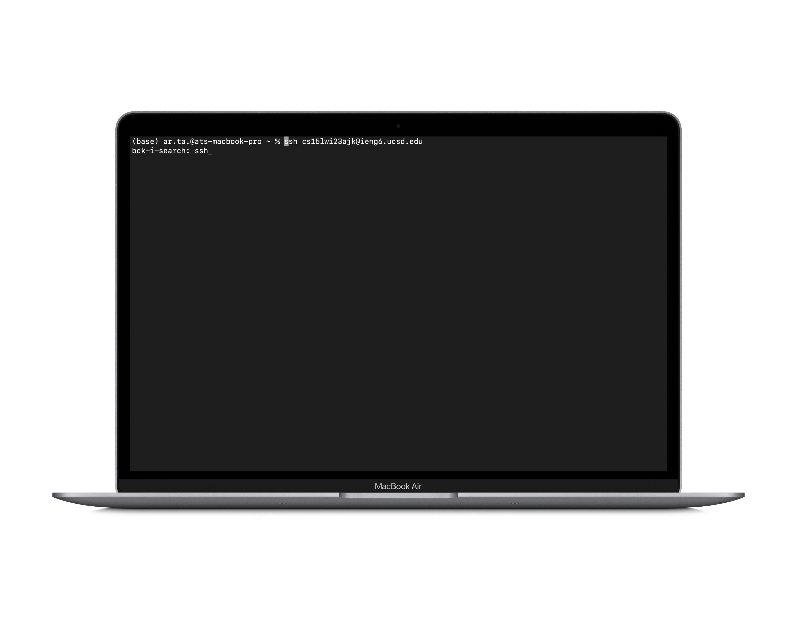
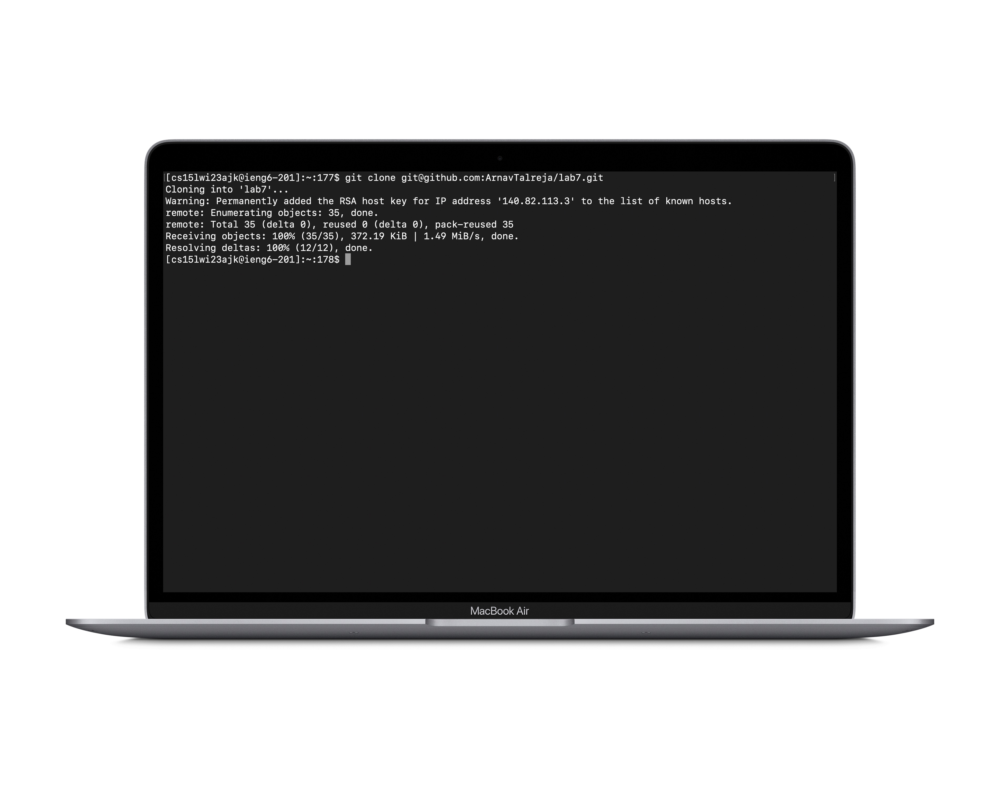
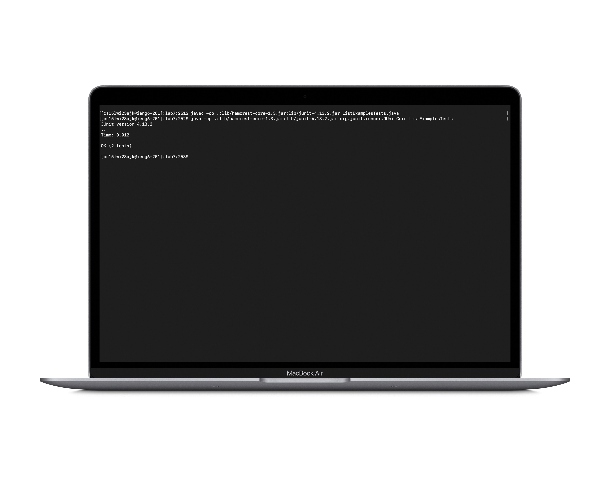
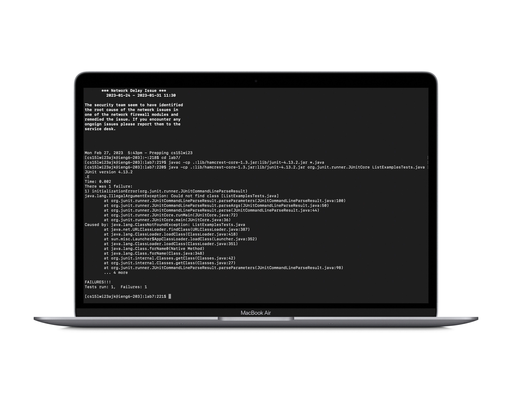
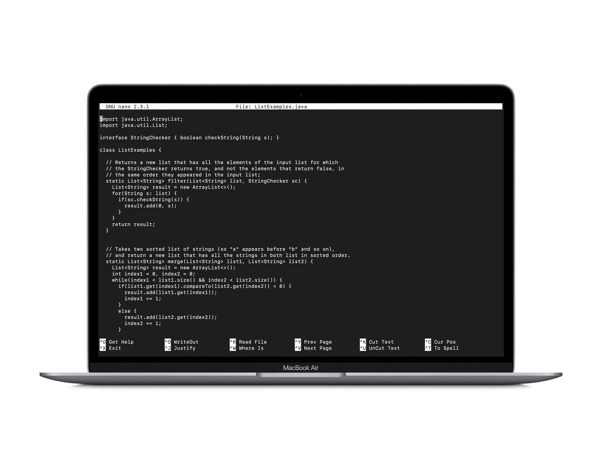
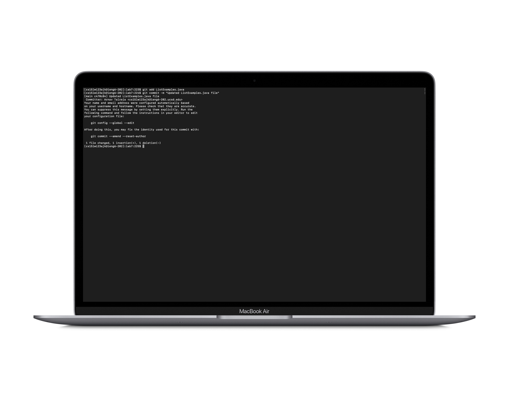

# CLDQ - CSE LABS "DONE QUICK"
This lab report is all about speeding up our work on the command line. To do so, we'll be using a bunch of keyboard shortcuts and some built-in command
line functions to optimize our work flow on the command line. For the purpose of hands on learning, we'll be executing the commands on a sample repository `lab7`.\
For setup, we'll be forking the `lab7` repository to our GitHub account.\
Get the stopwatches out!
## 3... 2... 1... GO!
### 1. Logging into `ieng6` server
We start off by logging into our course specific server.

```bash
  Keys Pressed: <Control + R> "ssh" <enter>
```
For this, I used the history function. Typing out ssh brought up he login command right up and since I have the ssh passkey set, all I had to do was press `<enter>` and I was in. Pretty simple!
### 2. Cloning the repository
We then move on to cloning the repository onto the `ieng6` server.

```bash
  Keys Pressed: "git clo" <tab> <command + V>
```
For this, I simply typed out `"git clo"` before hitting the `<tab>` key and allowing bash to auto-complete the command for me. I then pressed `<command + V>` to paste the link to the `lab7` repository I had copied to the clipboard earlier.
### 3. Compiling and running the code
Then, its onto running the tester to test the code given to us.

```bash
  1. Compiling the code:-
    Keys Pressed: <Control + R> "jav" <enter>
  2. Running the code:-
    Keys Pressed: <Control + R> "java -c" <right arrow> "Li" <tab> "Te" <tab> ".java" <enter>
```
For this, I used the history function again. Typing `"jav"` brought up the command to compile all the java files in the repository at once. All I had to do was hit `<enter>`.
I did the exact same thing for pulling up the command to run the code and once again, all I had to do was hit `<enter>`.
### 4. Fixing the errors
Compiling and running the tester displayed error messages which looked like the following:-



So, the next step was to open up and edit the `ListExamples.java` file and fix the bugs.\

```bash
  Keys Pressed: "nan" <tab> "Li" <tab> ".java" <enter> <Control + W> "index1"
```
For doing so, I used the `nano` command. I then used the `Where is` function on the `nano` screen to navigate to line 42 where I switched `index1` with `index2`.
### 5. Compiling and running the code (AGAIN!)
Basically repeated step 3. here and everything was running smoothly!

```bash
  1. Compiling the code:-
    Keys Pressed: <Control + R> "jav" <enter>
  2. Running the code:-
    Keys Pressed: <Control + R> "java -c" <right arrow> "Li" <tab> "Te" <tab> ".java" <enter>
```
### 6. Pushing the updated file to GitHub
We use the `git add` and `git commit -m` commands to push the updated file onto GitHub.

```bash
  1. Adding ListExamples.java to the files that are to be commited
    Keys Pressed: "git add" "Li" <tab> ".java" <enter>
  2. Commit
    Keys Pressed: "git commit -m 'Updated ListExamples.java' <enter>
```

